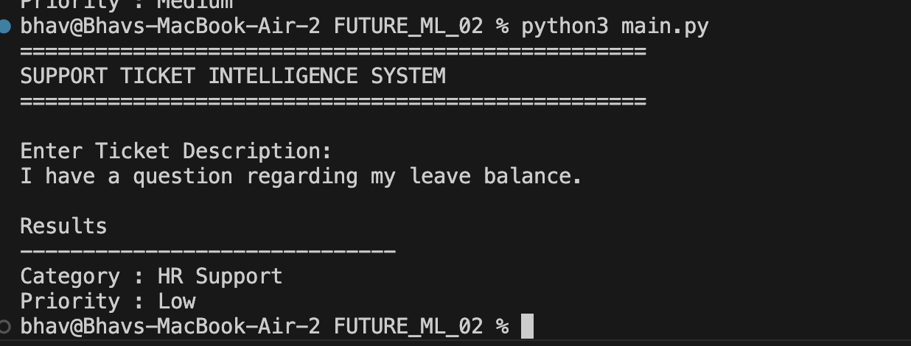
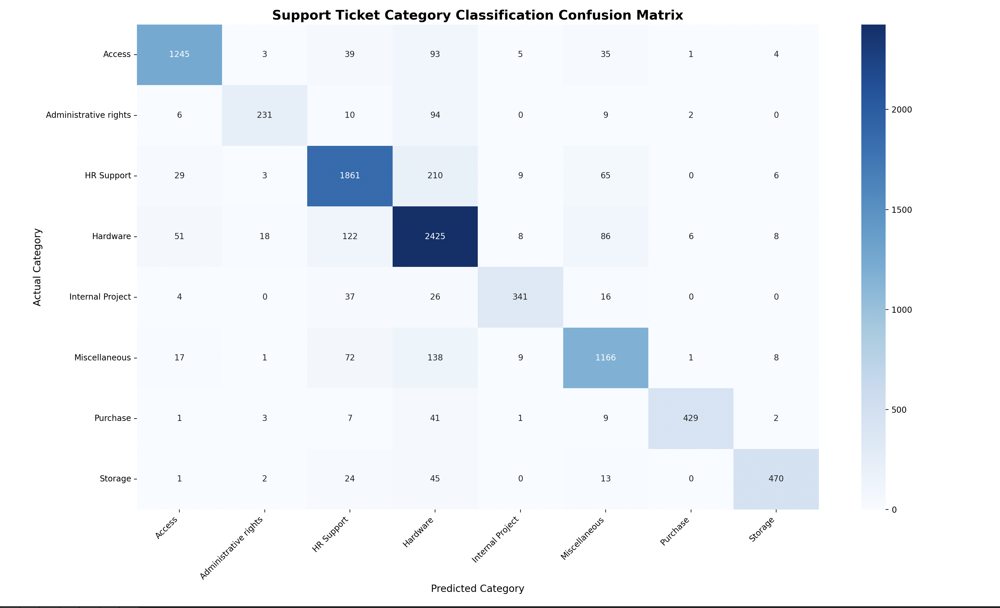

# Support Ticket Intelligence System

This project was built to understand how machine learning can be used in support operations. The idea is simple: instead of manually reading and sorting support tickets, a model can predict what type of issue the ticket belongs to and how urgent it is.

The project uses NLP techniques such as text preprocessing and TF-IDF vectorization along with machine learning models for classification.

---

## Why I Built This

Most ML projects online are either house price prediction or stock forecasting. I wanted to work on something that looked closer to a real business problem.

Support teams receive a large number of tickets every day. Before solving the issue, someone usually has to read the ticket and decide where it should go. This project tries to automate that step.

---

## Dataset

I used the IT Service Ticket Classification Dataset from Kaggle:

https://www.kaggle.com/datasets/adisongoh/it-service-ticket-classification-dataset

The dataset contains support ticket descriptions along with their categories.

Main columns used:

* Document
* Topic_group

The dataset has categories such as:

* Access
* Administrative Rights
* Hardware
* HR Support
* Internal Project
* Miscellaneous
* Purchase
* Storage

Since the dataset did not contain priority labels, I created High, Medium and Low priority levels using category-based business rules.

---

## What the Project Does

Given a support ticket like:

"Unable to login to company VPN after password reset"

the system predicts:

Category: Access

Priority: High

The goal is to help support teams route tickets faster and identify important requests earlier.

---

## Project Workflow

### 1. Text Preprocessing

The ticket text is cleaned before training.

Steps performed:

* Convert text to lowercase
* Remove punctuation
* Remove stopwords
* Remove unnecessary characters

Example:

Before:

Unable to login to company VPN after password reset.

After:

unable login company vpn password reset

---

### 2. Feature Extraction

TF-IDF Vectorization is used to convert text into numerical features that can be used by machine learning models.

---

### 3. Category Classification

A Logistic Regression model is trained to predict the ticket category.

Example:

"My laptop battery drains completely within one hour"

Prediction:

Hardware

---

### 4. Priority Prediction

The project also predicts ticket priority.

Priority Levels:

* High
* Medium
* Low

Since priority labels were not available in the original dataset, they were generated using category mappings and then used to train a separate model.

---

## Results

Category Classification Accuracy:

85.37%

The model performs reasonably well across most categories and is able to correctly classify the majority of support tickets.

Some categories have overlapping vocabulary, which occasionally leads to misclassification. This can be seen in the confusion matrix generated during evaluation.

---

## Technologies Used

* Python
* Pandas
* NumPy
* Scikit-learn
* NLTK
* Matplotlib
* Seaborn
* Streamlit

---

## Project Structure

SUPPORT_TICKET_INTELLIGENCE_SYSTEM/

├── data/

├── src/

├── models/

├── reports/

├── notebooks/

├── requirements.txt

├── README.md

└── main.py

---

## Running the Project

Install dependencies:

pip install -r requirements.txt

Train category model:

python train_category_model.py

Train priority model:

python train_priority_model.py

Run the application:

python main.py

---

## Application Demo

## Confusion Matrix

---

## Future Improvements

A few things I would like to add in future versions:

* BERT-based classification
* Better priority prediction using real labels
* Ticket dashboard with analytics
* Deployment on cloud

---

## Author

Bhav Shah

B.Tech Computer Engineering

K. J. Somaiya School of Engineering

